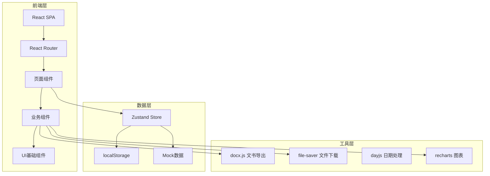
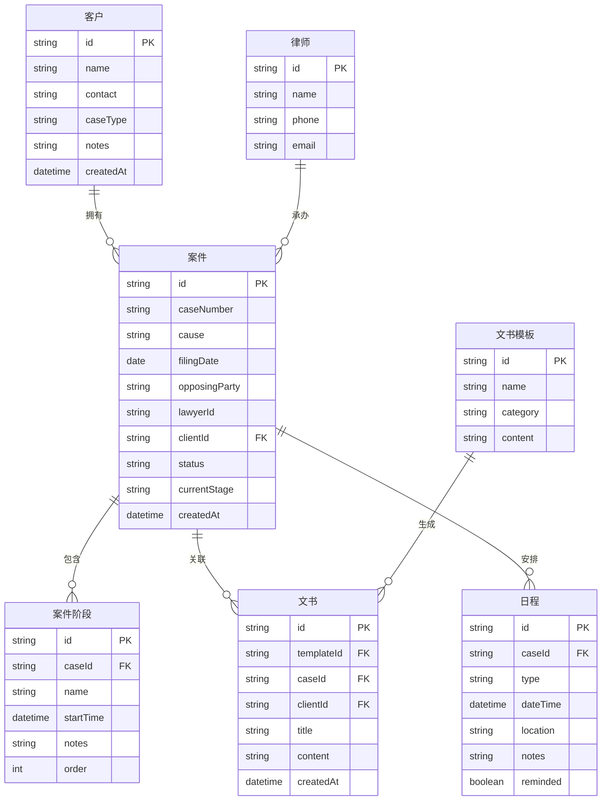

## 1. 架构设计



## 2. 技术说明

- **前端**：React@18 + TypeScript + Tailwind CSS@3 + Vite
- **初始化工具**：Vite (react-ts 模板)
- **后端**：无后端，纯前端应用
- **数据库**：localStorage 持久化，启动时初始化 Mock 数据
- **状态管理**：Zustand
- **路由**：React Router v6
- **UI组件**：Headless UI + Tailwind CSS 自定义组件
- **富文本编辑**：TipTap (基于 ProseMirror)
- **文书导出**：docx.js 生成 Word 文档
- **图表**：Recharts
- **日期处理**：dayjs
- **文件下载**：file-saver
- **提醒通知**：浏览器 Notification API + 自定义 Toast

## 3. 路由定义

| 路由 | 用途 |
|------|------|
| / | 工作台首页，展示数据概览、待办日程、近期案件 |
| /clients | 客户列表页，搜索、筛选、查看所有客户 |
| /clients/new | 新增客户表单页 |
| /clients/:id | 客户详情页，展示基本信息和关联案件 |
| /cases | 案件列表页，搜索、筛选、查看所有案件 |
| /cases/new | 新增案件表单页 |
| /cases/:id | 案件详情页，展示进度跟踪、关联文书、日程 |
| /documents | 文书模板列表页 |
| /documents/generate | 文书生成页，选择模板和案件 |
| /documents/generate/:templateId/:caseId | 文书编辑页，在线编辑并下载 |
| /schedule | 日程管理页，日历视图和日程列表 |
| /statistics | 数据统计页，图表展示和报表导出 |

## 4. API定义

无后端API，所有数据通过 Zustand Store 管理，使用 localStorage 持久化。

### 4.1 数据操作接口（Zustand Store Actions）

```typescript
interface ClientStore {
  clients: Client[]
  addClient: (client: Omit<Client, 'id' | 'createdAt'>) => void
  updateClient: (id: string, data: Partial<Client>) => void
  deleteClient: (id: string) => void
  getClient: (id: string) => Client | undefined
}

interface CaseStore {
  cases: Case[]
  addCase: (caseData: Omit<Case, 'id' | 'createdAt' | 'stages'>) => void
  updateCase: (id: string, data: Partial<Case>) => void
  deleteCase: (id: string) => void
  getCase: (id: string) => Case | undefined
  addStage: (caseId: string, stage: Omit<Stage, 'id'>) => void
  updateStage: (caseId: string, stageId: string, data: Partial<Stage>) => void
}

interface DocumentStore {
  documents: Document[]
  generateDocument: (templateId: string, caseId: string) => Document
  updateDocument: (id: string, content: string) => void
  deleteDocument: (id: string) => void
  downloadDocument: (id: string) => void
}

interface ScheduleStore {
  schedules: Schedule[]
  addSchedule: (schedule: Omit<Schedule, 'id' | 'reminded'>) => void
  updateSchedule: (id: string, data: Partial<Schedule>) => void
  deleteSchedule: (id: string) => void
  getUpcoming: (days: number) => Schedule[]
  checkReminders: () => Schedule[]
}
```

## 5. 服务器架构图

不适用（纯前端应用）

## 6. 数据模型

### 6.1 数据模型定义



### 6.2 数据定义

```typescript
interface Client {
  id: string
  name: string
  contact: string
  caseType: string
  notes: string
  createdAt: string
}

interface Case {
  id: string
  caseNumber: string
  cause: string
  filingDate: string
  opposingParty: string
  lawyerId: string
  clientId: string
  status: '进行中' | '已结案' | '已归档'
  currentStage: string
  stages: Stage[]
  createdAt: string
}

interface Stage {
  id: string
  name: string
  startTime: string
  notes: string
  order: number
}

interface DocumentTemplate {
  id: string
  name: string
  category: string
  content: string
}

interface Document {
  id: string
  templateId: string
  caseId: string
  clientId: string
  title: string
  content: string
  createdAt: string
}

interface Schedule {
  id: string
  caseId: string
  type: '开庭' | '会见' | '其他'
  dateTime: string
  location: string
  notes: string
  reminded: boolean
}

interface Lawyer {
  id: string
  name: string
  phone: string
  email: string
}
```

### 6.3 初始数据

系统启动时注入 Mock 数据，包含：
- 3个律师账号
- 5个客户
- 8个案件（涵盖不同案件类型和状态）
- 每个案件包含2-4个进度阶段
- 3个文书模板（起诉状、答辩状、代理词）
- 5个日程安排
